<div align="center">

# 🚗 BATON

### **B**ehavioral **A**nalysis of **T**ransition and **O**peration in **N**aturalistic Driving

<p>
  <a href="https://arxiv.org/abs/2604.07263">
    
  </a>
  &nbsp;
  <a href="https://huggingface.co/datasets/HenryYHW/BATON">
    
  </a>
  &nbsp;
  <a href="https://huggingface.co/datasets/HenryYHW/BATON-Sample">
    
  </a>
  &nbsp;
  <a href="https://creativecommons.org/licenses/by-nc/4.0/">
    
  </a>
</p>

*A large-scale multimodal benchmark for bidirectional human–DAS control transition in naturalistic driving*<br/>
*Submitted to ACM Multimedia 2026*

</div>

---

<div align="center">
  
</div>

---

## 🎬 Live Preview

<table width="100%">
<tr>
  <td width="38%" align="center" valign="top">
    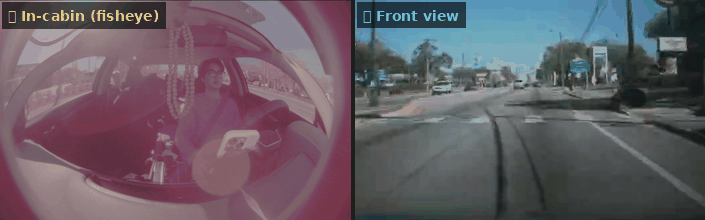
    <br/><sub><b>Continuous sequence</b> — cabin fisheye · front view · 5 fps</sub>
  </td>
  <td width="24%" align="center" valign="top">
    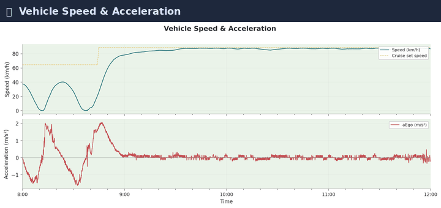
    <br/><sub><b>8 CAN/IMU sensor streams</b><br/>cycling through all channels</sub>
  </td>
  <td width="38%" align="center" valign="top">
    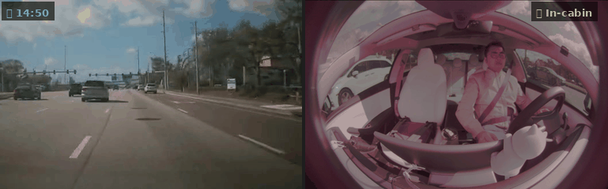
    <br/><sub><b>Daytime time-lapse</b> — front · cabin · 2-min intervals</sub>
  </td>
</tr>
</table>

<div align="center">
  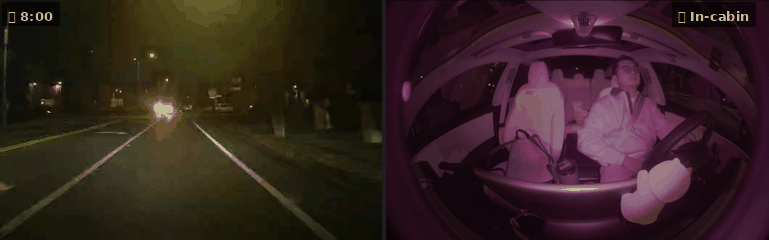
  <br/>
  <sub><b>Nighttime driving</b> — time-lapse with <b>⬆ DAS Handover</b> and <b>↩ Human Takeover</b> event highlights</sub>
</div>

---

## 📊 Dataset at a Glance

<div align="center">

| 🌍 Routes | 👤 Drivers | 🚙 Car Models | ⏱️ Duration | 🔄 Handover Events |
|:---------:|:----------:|:-------------:|:-----------:|:-----------------:|
| **380** | **127** | **84** | **136.6 h** | **2,892** |

| 🤖 DAS Driving | 🧑 Human Driving | ⬆️ DAS Handover | ↩️ Human Takeover | 🌍 Coverage |
|:--------------:|:----------------:|:---------------:|:-----------------:|:-----------:|
| 52.5% | 47.5% | **1,460** | **1,432** | 6 Continents |

</div>

<div align="center">
  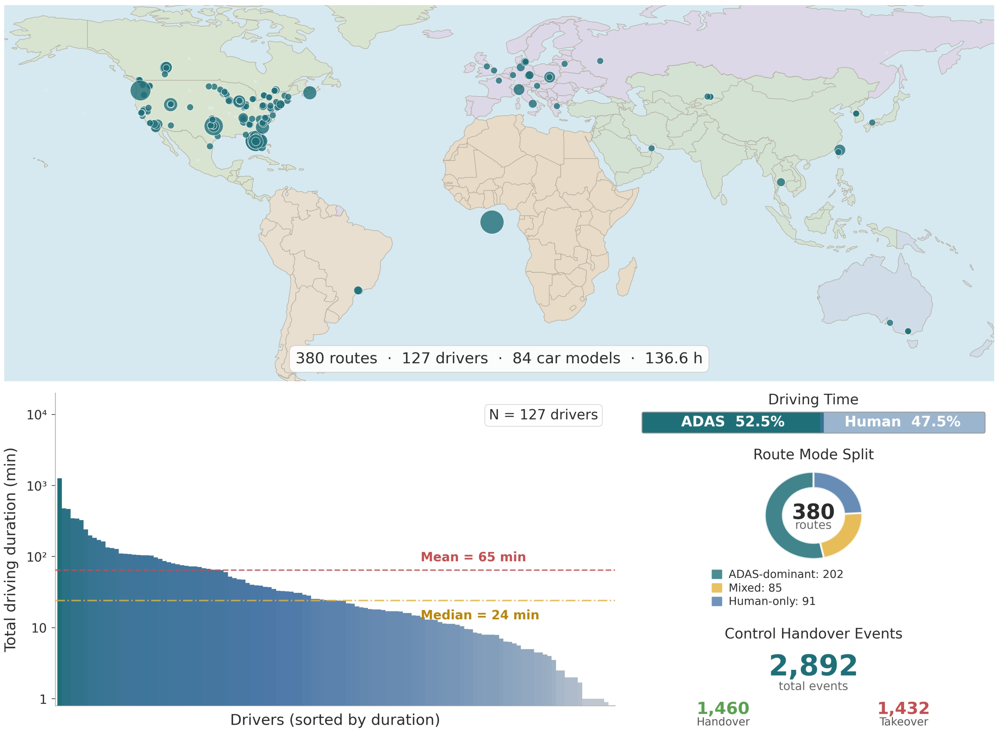
  <br/><sub><i>Global distribution of participants, per-driver duration, and handover event breakdown.</i></sub>
</div>

---

## 🔬 Data Collection & Modalities

<table>
<tr>
<td width="42%" valign="top">

**Setup:** Non-intrusive plug-and-play OBD-II dongle + dual cameras. Drivers use their own vehicles during real daily commutes — no lab, no script.

| Component | Spec |
|-----------|------|
| 📡 OBD-II Dongle | CAN-bus at 100 Hz |
| 📷 Front camera | 526×330 · H.264 · 20 fps |
| 🎥 Cabin fisheye | 1928×1208 · HEVC · 20 fps |
| 🛰️ GPS | 10 Hz |

**9 synchronized modalities:**
- `vehicle_dynamics.csv` — speed, accel, steering, pedals, DAS status
- `planning.csv` — DAS curvature, lane change intent
- `radar.csv` — lead vehicle distance & relative speed
- `driver_state.csv` — face pose, eye openness, awareness
- `imu.csv` — 3-axis accel & gyro at 100 Hz
- `gps.csv` — coordinates, heading
- `localization.csv` — road curvature, lane position
- `qcamera.mp4` — front-view video
- `dcamera.mp4` — in-cabin fisheye video

</td>
<td width="58%" valign="top">

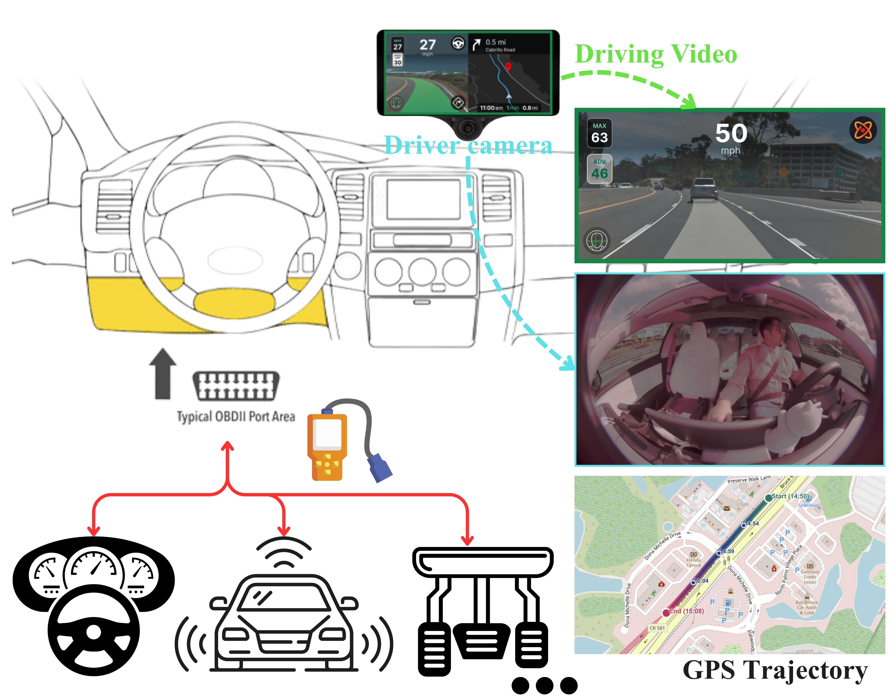

<table>
<tr>
  <td align="center">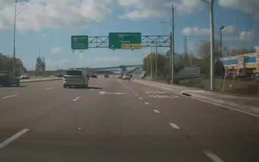<br/><sub>📷 Front · Day</sub></td>
  <td align="center">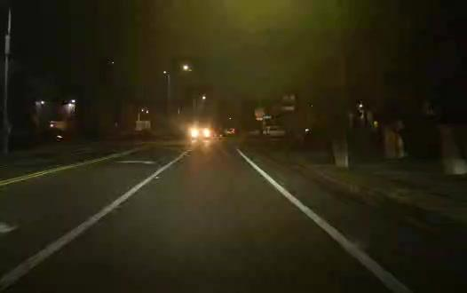<br/><sub>📷 Front · Night</sub></td>
  <td align="center">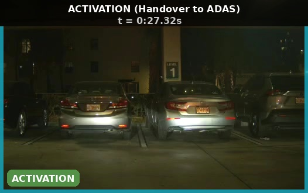<br/><sub>⬆️ DAS Handover</sub></td>
</tr>
<tr>
  <td align="center">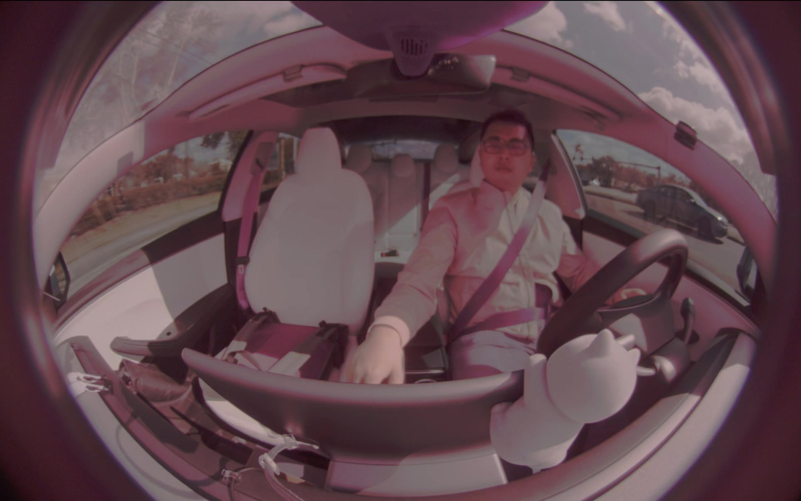<br/><sub>🎥 Cabin · Day</sub></td>
  <td align="center">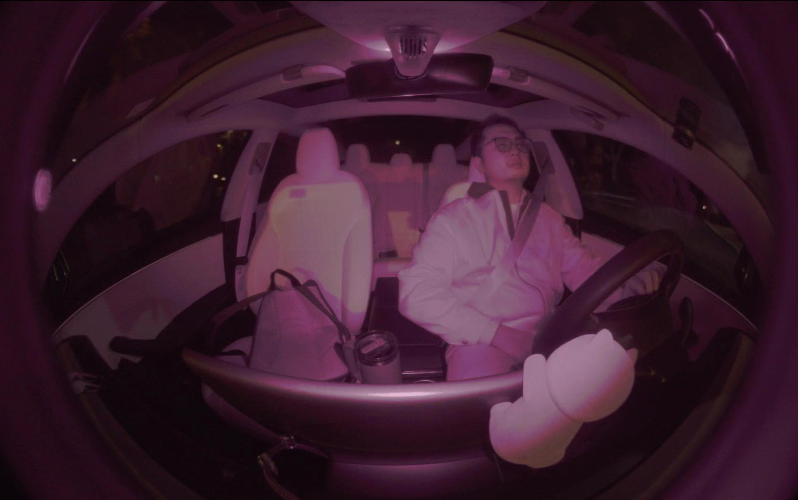<br/><sub>🎥 Cabin · Night</sub></td>
  <td align="center">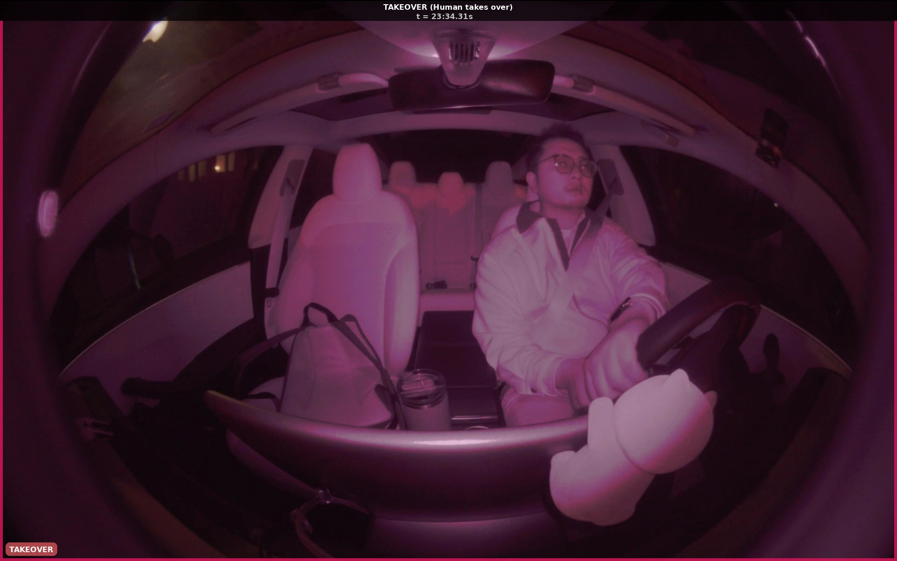<br/><sub>↩️ Takeover</sub></td>
</tr>
</table>

</td>
</tr>
</table>

<div align="center">
  
  <br/><sub><i>Aligned multimodal streams around a HANDOVER event: cabin video · front video · GPS trajectory · sensor signals.</i></sub>
</div>

---

## 🏆 Benchmark Tasks

<div align="center">
  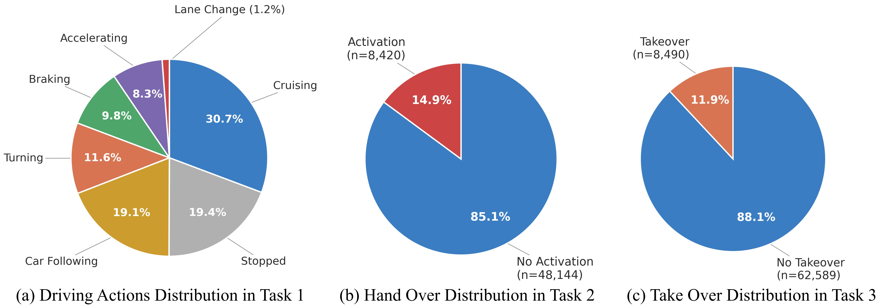
</div>

<br/>

| Task | Description | Samples | Labels | Primary Metric |
|------|-------------|:-------:|--------|:--------------:|
| 🎯 **Task 1** | Driving action recognition (7-class) | 979,809 | Cruising · Car Following · Accelerating · Braking · Lane Change · Turning · Stopped | Macro-F1 |
| ⬆️ **Task 2** | Handover prediction (Human→DAS) | 56,564 | Handover (14.9%) · No Handover | AUPRC |
| ↩️ **Task 3** | Takeover prediction (DAS→Human) | 71,079 | Takeover (11.9%) · No Takeover | AUPRC |

> **Evaluation protocol:** Cross-driver split · 5-second input window · 3-second prediction horizon · 3 seeds (42, 123, 7)

---

## 📁 Repository Structure

```
BATON/
├── benchmark/                   # Benchmark data and generation code
│   ├── generate_benchmark.py        # Full benchmark construction pipeline
│   ├── routes.csv                   # Route metadata (380 routes)
│   ├── action_labels.csv            # 1 Hz action labels
│   ├── task1_action_samples.csv     # Task 1 samples
│   ├── task2_activation_samples_h{1,3,5}.csv   # Task 2 at 3 horizons
│   ├── task3_takeover_samples_h{1,3,5}.csv     # Task 3 at 3 horizons
│   ├── split_cross_driver.json      # Primary evaluation split
│   ├── split_cross_vehicle.json     # Cross-vehicle split
│   ├── split_random.json            # Random split
│   └── benchmark_protocol.md        # Detailed protocol specification
│
├── baseline/                    # Training and evaluation code
│   ├── config.py                    # Paths, modality definitions, hyperparameters
│   ├── dataset.py                   # PyTorch dataset for all tasks
│   ├── models.py                    # GRU and TCN with gated fusion
│   ├── metrics.py                   # Evaluation metrics
│   ├── train_nn.py                  # Neural network training (GRU / TCN)
│   ├── train_classical.py           # XGBoost and LR baselines
│   ├── run_vlm.py                   # Zero-shot VLM baselines (Gemini / GPT-4o)
│   ├── vlm_prompts.py               # VLM prompt construction
│   └── collect_results.py           # Aggregate and print result tables
│
└── data_processing/             # Feature extraction scripts
    ├── extract_front_video_features.py    # EfficientNet-B0 front video
    ├── extract_cabin_video_features.py    # EfficientNet-B0 cabin video
    ├── extract_clip_features.py           # CLIP ViT-B/32 features
    ├── video_utils.py                     # Shared video decoding utilities
    └── gps_semantic_enrichment.py         # GPS → road context features
```

---

## 🚀 Quick Start

### 1. Get the data

```bash
# Sample dataset (~few GB, all modalities, 43 routes)
git lfs install
git clone https://huggingface.co/datasets/HenryYHW/BATON-Sample

# Full dataset — download via HuggingFace Hub
python -c "
from huggingface_hub import snapshot_download
snapshot_download('HenryYHW/BATON', repo_type='dataset', local_dir='./data')
"
```

### 2. Preprocess signals

```bash
cd baseline
python preprocess.py
```

### 3. Extract video features

```bash
cd data_processing

# EfficientNet-B0 features (used in main baselines)
python extract_front_video_features.py
python extract_cabin_video_features.py

# CLIP ViT-B/32 features (optional)
python extract_clip_features.py
```

### 4. Train baselines

```bash
cd baseline

# GRU on all modalities — Task 1
python train_nn.py --task task1 --modality Full-All --model gru --seed 42

# XGBoost on structured signals — Task 2
python train_classical.py --task task2 --model xgb --seed 42

# TCN ablation — Task 3, sensors only
python train_nn.py --task task3 --modality Text --model tcn --seed 42

# Zero-shot VLM baseline (GPT-4o or Gemini 2.5 Flash)
python run_vlm.py --model gpt4o --task task1
python run_vlm.py --model gemini --task task2
```

### 5. Collect results

```bash
python collect_results.py   # prints all result tables
```

---

## 📐 Evaluation Protocol

| Setting | Value |
|---------|-------|
| **Primary split** | Cross-driver (disjoint drivers in train / val / test) |
| **Additional splits** | Cross-vehicle, Random |
| **Input window** | 5 seconds |
| **Prediction horizon** | 1 s, 3 s, 5 s (main: **3 s**) |
| **Random seeds** | 42, 123, 7 — report 3-seed average |
| **Task 1 metric** | Macro-F1 |
| **Task 2 / 3 metrics** | AUPRC (primary), AUC-ROC, F1 |

---

## 📡 Data Access

| Resource | Link |
|----------|------|
| 📦 Full Dataset | [HuggingFace — HenryYHW/BATON](https://huggingface.co/datasets/HenryYHW/BATON) |
| 🔍 Sample Dataset (43 routes) | [HuggingFace — HenryYHW/BATON-Sample](https://huggingface.co/datasets/HenryYHW/BATON-Sample) |
| 📄 arXiv Paper | [arxiv.org/abs/2604.07263](https://arxiv.org/abs/2604.07263) |

---

## 📜 Citation

```bibtex
@article{wang2026baton,
  title   = {BATON: A Multimodal Benchmark for Bidirectional Automation Transition
             Observation in Naturalistic Driving},
  author  = {Wang, Yuhang and Xu, Yiyao and Yang, Chaoyun and Li, Lingyao
             and Sun, Jingran and Zhou, Hao},
  journal = {arXiv preprint arXiv:2604.07263},
  year    = {2026}
}
```

---

## 📄 License

This dataset is released for **academic research use only** under [**CC BY-NC 4.0**](https://creativecommons.org/licenses/by-nc/4.0/) (Creative Commons Attribution–NonCommercial 4.0 International).

**You are free to** use and redistribute the data for non-commercial research, and to adapt or build upon it for non-commercial purposes — **provided that:**

- **Attribution** — You must cite the BATON paper (see Citation above) in any publication or work that uses this dataset.
- **Non-Commercial** — Commercial use of this dataset or any derivative is **strictly prohibited**.
- **Academic Use Only** — This dataset is intended solely for academic research. Use in any commercial product, service, or application is not permitted.

For commercial licensing inquiries, please contact the authors.

---

<div align="center">
  <sub>
    🔗 <a href="https://arxiv.org/abs/2604.07263">Paper</a> &nbsp;·&nbsp;
    <a href="https://huggingface.co/datasets/HenryYHW/BATON">Full Dataset</a> &nbsp;·&nbsp;
    <a href="https://huggingface.co/datasets/HenryYHW/BATON-Sample">Sample Dataset</a> &nbsp;·&nbsp;
    <a href="https://github.com/OpenLKA/BATON">GitHub</a>
  </sub>
</div>
